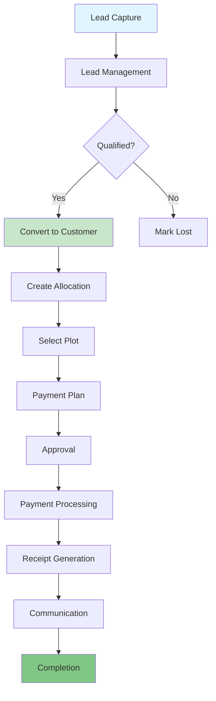
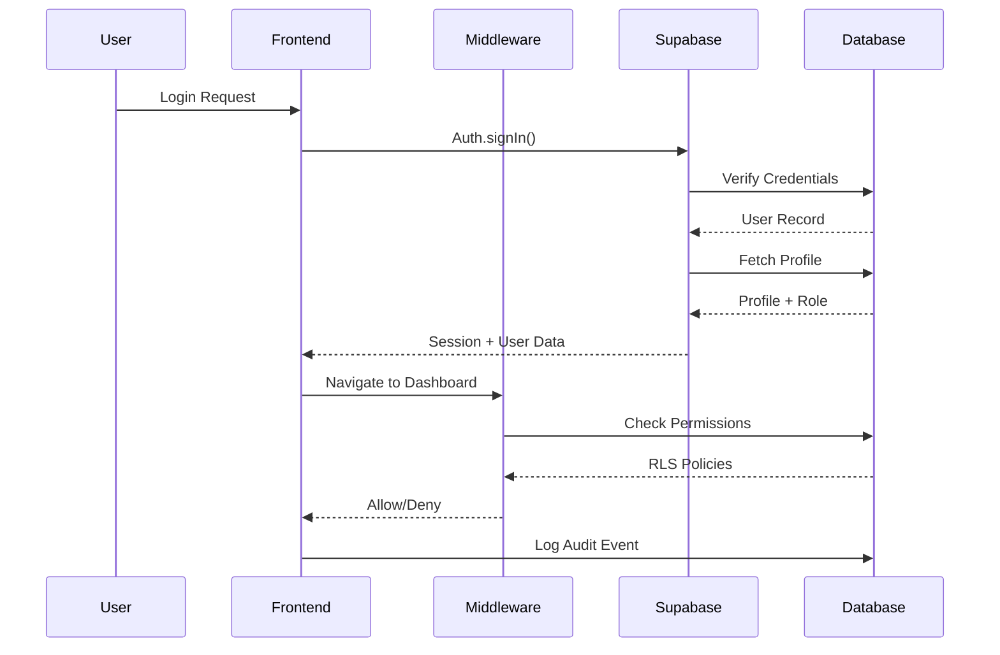
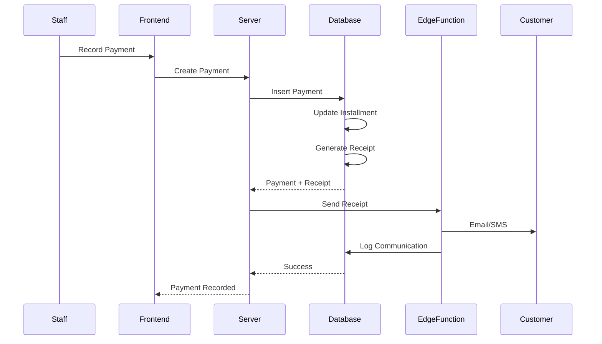
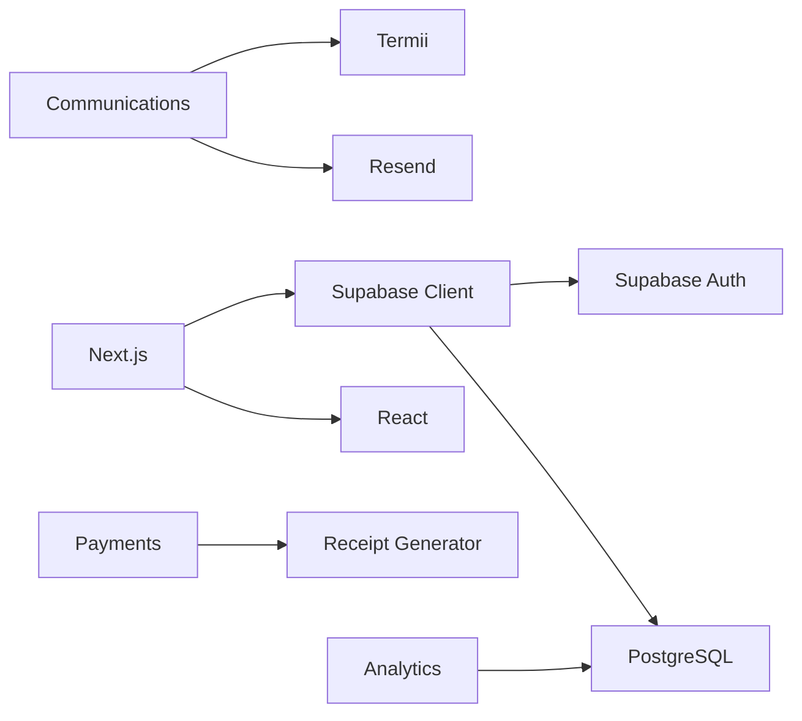

# Acrely System Architecture

**Last Updated**: 2025-12-29  
**Owner**: @lordkay  
**Status**: Active Production System

---

## Table of Contents

1. [System Overview](#system-overview)
2. [Core Systems](#core-systems)
3. [Data Flow](#data-flow)
4. [Integration Points](#integration-points)
5. [Dependencies](#dependencies)
6. [Deprecation Paths](#deprecation-paths)

---

## System Overview

Acrely is a comprehensive real estate management platform built on Next.js 16 (App Router) with Supabase as the backend. The system manages the complete lifecycle of real estate sales, from lead generation through allocation, payment processing, and customer management.

### Technology Stack

- **Frontend**: Next.js 16 (App Router), React 19, TypeScript, Tailwind CSS
- **Backend**: Supabase (PostgreSQL, Auth, Storage, Edge Functions)
- **Email**: Resend API
- **SMS**: Termii API (via Edge Functions)
- **Deployment**: Vercel
- **Testing**: Playwright (E2E), Vitest (Unit)

---

## Core Systems

### 1. Authentication & Authorization

**Purpose**: Secure user authentication and role-based access control  
**Owner**: @lordkay  
**Status**: Active  
**Location**: `/src/lib/auth/`, `/src/middleware.ts`

**Components**:
- Supabase Auth integration
- Role-based access control (RBAC): sysadmin, ceo, md, frontdesk, customer
- Rate limiting for login attempts
- Password policy enforcement
- Session management

**Dependencies**:
- Supabase Auth
- `profiles` table for user metadata
- `audit_logs` for auth events

**Data Flow**:
```
User Login → Supabase Auth → Profile Lookup → Role Check → Session Creation → Audit Log
```

**Deprecation Path**: None - core system

---

### 2. Customer Management

**Purpose**: Manage customer records, notes, tags, and lifecycle  
**Owner**: @lordkay  
**Status**: Active  
**Location**: `/src/components/customers/`, `/src/app/(dashboard)/dashboard/customers/`

**Components**:
- Customer CRUD operations
- Lead conversion to customer
- Customer notes and tags
- Customer timeline/activity tracking
- Soft delete with 90-day retention

**Dependencies**:
- `customers` table
- `customer_notes` table
- `customer_tags` table
- `leads` table (for conversion)
- `allocations` table (customer purchases)

**Data Flow**:
```
Lead → Convert → Customer → Allocation → Payments → Completion
```

**Lifecycle**:
- Create: Via lead conversion or direct creation
- Update: Profile updates, notes, tags
- Soft Delete: `deleted_at` timestamp
- Hard Delete: After 90 days (via cleanup job)

**Deprecation Path**: None - core system

---

### 3. Estates & Plots Management

**Purpose**: Manage real estate properties and plot inventory  
**Owner**: @lordkay  
**Status**: Active  
**Location**: `/src/components/estates/`, `/src/components/plots/`

**Components**:
- Estate creation and management
- Plot grid visualization
- Plot status tracking (available, reserved, sold, unavailable)
- Plot reservation system with expiry
- Archival for inactive estates

**Dependencies**:
- `estates` table
- `plots` table
- `allocations` table (plot assignments)

**Data Flow**:
```
Estate Creation → Plot Generation → Plot Reservation → Allocation → Plot Sold
```

**Lifecycle**:
- Create: Estate with auto-generated plots
- Update: Status changes, pricing updates
- Archive: `archived_at` for inactive estates
- Terminal States: Available, Sold, Reserved, Unavailable

**Deprecation Path**: None - core system

---

### 4. Allocations & Sales

**Purpose**: Manage plot allocations and sales process  
**Owner**: @lordkay  
**Status**: Active  
**Location**: `/src/components/allocations/`, `/src/app/(dashboard)/dashboard/allocations/`

**Components**:
- Multi-step allocation wizard
- Approval workflow (pending → approved → completed)
- Plot reassignment tracking
- Cancellation with reason tracking
- Payment plan integration

**Dependencies**:
- `allocations` table
- `allocation_reassignments` table
- `plots` table
- `customers` table
- `payment_plans` table
- `payments` table

**Data Flow**:
```
Customer Selection → Plot Selection → Payment Plan → Approval → Payment → Completion
```

**Lifecycle**:
- Create: Via allocation wizard
- Update: Status transitions, reassignments
- Cancel: With reason tracking, plot released
- Complete: Final state, plot marked sold

**Deprecation Path**: None - core system

---

### 5. Payments & Financial

**Purpose**: Payment recording, tracking, and receipt generation  
**Owner**: @lordkay  
**Status**: Active  
**Location**: `/src/components/payments/`, `/src/lib/payments.ts`

**Components**:
- Payment recording
- Payment plan management
- Installment tracking
- Receipt generation (PDF)
- Payment reversal
- Payment analytics

**Dependencies**:
- `payments` table
- `payment_plans` table
- `payment_plan_installments` table
- `receipts` table
- `allocations` table
- `customers` table

**Data Flow**:
```
Allocation → Payment Plan → Installments → Payment Recording → Receipt Generation → Communication
```

**Lifecycle**:
- Create: Payment recording with receipt
- Update: Status changes
- Reverse: Payment reversal with audit trail
- No deletion - financial records are immutable

**Deprecation Path**: None - core system

---

### 6. Leads & CRM

**Purpose**: Lead capture, qualification, and conversion  
**Owner**: @lordkay  
**Status**: Active  
**Location**: `/src/components/leads/`, `/src/app/(dashboard)/dashboard/leads/`

**Components**:
- Lead creation and management
- Lead assignment to agents
- Follow-up tracking with overdue detection
- Lead conversion to customer
- Lead notes and activity timeline

**Dependencies**:
- `leads` table
- `agents` table
- `customers` table (conversion target)
- `notifications` (overdue alerts)

**Data Flow**:
```
Lead Creation → Assignment → Follow-ups → Qualification → Conversion → Customer
```

**Lifecycle**:
- Create: Manual or via web form
- Update: Status changes, follow-up dates
- Convert: Becomes customer
- Soft Delete: Status change to "lost"
- **Missing**: Archival policy for old leads (2+ years)

**Deprecation Path**: None - core system

---

### 7. Communications Engine

**Purpose**: Unified messaging across email, SMS, WhatsApp, and in-app  
**Owner**: @lordkay  
**Status**: Active  
**Location**: `/src/lib/communications/`, `/supabase/functions/send-message/`

**Components**:
- Template-based messaging
- Multi-channel support with failover (SMS → Email → In-App)
- Quiet hours enforcement
- Scheduled communications
- Retry logic with exponential backoff
- Delivery tracking and logging

**Dependencies**:
- `communication_templates` table
- `communication_logs` table
- `scheduled_communications` table
- `notifications` table (in-app)
- Resend API (email)
- Termii API (SMS)

**Lifecycle**:
- Templates: Create, update, **missing versioning**
- Messages: Send, retry, deliver/fail, log
- Scheduled: Create, process, complete/fail, **missing cleanup**

**Deprecation Path**: 
- Template versioning needed before deprecation
- Old templates should be marked deprecated, not deleted

---

### 8. Audit & Logging

**Purpose**: Comprehensive audit trail and structured logging  
**Owner**: @lordkay  
**Status**: Active  
**Location**: `/src/lib/logger.ts`, `/src/lib/audit.ts`

**Components**:
- Centralized logger with levels (debug, info, warn, error)
- Audit log for all critical actions
- Actor tracking (user, role)
- Target entity tracking
- Change tracking (before/after)
- IP address and user agent capture

**Dependencies**:
- `audit_logs` table
- All feature modules (consumers)

**Data Flow**:
```
Action → Logger/Audit Call → Structured Log Entry → Database Persistence
```

**Lifecycle**:
- Logs: Create only, no updates or deletes
- Retention: 7 years for audit logs, 1 year for general logs

**Deprecation Path**: None - core system

---

### 9. Background Jobs & Automation

**Purpose**: Scheduled tasks and async processing  
**Owner**: @lordkay  
**Status**: Active  
**Location**: `/supabase/functions/`, `/supabase/CRON_SETUP.md`

**Components**:
- Database backups (daily)
- Backup verification (weekly)
- Backup cleanup (monthly)
- Scheduled communications processing
- Overdue lead checking (client-side polling)
- Plot reservation expiry

**Dependencies**:
- Supabase Edge Functions
- Supabase Cron (pg_cron)
- `backup_logs` table
- `scheduled_communications` table

**Data Flow**:
```
Cron Trigger → Edge Function → Business Logic → Database Update → Logging → Alerting (if failure)
```

**Lifecycle**:
- Jobs: Scheduled, execute, log
- Logs: Retained indefinitely, **needs cleanup policy**

**Deprecation Path**: 
- Client-side overdue checking should migrate to server-side cron
- Old backup logs should be archived after 1 year

---

### 10. Staff Management

**Purpose**: Internal staff user management and permissions  
**Owner**: @lordkay  
**Status**: Active  
**Location**: `/src/components/staff/`, `/src/app/(dashboard)/dashboard/staff/`

**Components**:
- Staff invitation system
- Role assignment (sysadmin, ceo, md, frontdesk)
- Staff activation/deactivation
- Staff change history tracking
- Employee ID management

**Dependencies**:
- `profiles` table
- `staff_change_history` table
- `auth.users` table
- Email system (invitations)

**Data Flow**:
```
Invite Staff → Email Sent → User Signup → Profile Creation → Role Assignment → Activation
```

**Lifecycle**:
- Create: Via invitation
- Update: Role changes, profile updates
- Deactivate: `is_active = false`
- **Missing**: Offboarding process, data reassignment

**Deprecation Path**: 
- Need formal offboarding workflow
- Define what happens to staff-owned records on termination

---

### 11. Analytics & Reporting

**Purpose**: Business intelligence and performance metrics  
**Owner**: @lordkay  
**Status**: Active  
**Location**: `/src/lib/actions/analytics-actions.ts`, `/src/app/(dashboard)/dashboard/analytics/`

**Components**:
- Customer analytics
- Agent performance tracking
- Sales metrics
- Payment analytics
- Lead conversion tracking
- Custom report generation

**Dependencies**:
- All core tables (customers, allocations, payments, leads)
- `customer_analytics` table (materialized view)

**Data Flow**:
```
User Request → Analytics Query → Data Aggregation → Visualization → Export (optional)
```

**Lifecycle**:
- Analytics data: Computed on-demand or cached
- Reports: Generated, downloaded, not stored

**Deprecation Path**: None - core system

---

## Data Flow

### High-Level System Flow



### Authentication Flow



### Payment Flow



---

## Integration Points

### External Services

1. **Supabase**
   - Authentication
   - Database (PostgreSQL)
   - Storage (file uploads)
   - Edge Functions (serverless)
   - Realtime subscriptions

2. **Resend** (Email)
   - Transactional emails
   - Receipt delivery
   - Staff invitations
   - Password resets

3. **Termii** (SMS)
   - SMS notifications
   - Payment confirmations
   - OTP delivery

4. **Vercel** (Hosting)
   - Next.js deployment
   - Edge network
   - Analytics

### Internal APIs

1. **Server Actions** (`/src/lib/actions/`)
   - Analytics queries
   - Data exports
   - Form submissions

2. **API Routes** (`/src/app/api/`)
   - Admin operations
   - Authentication callbacks
   - Backup management
   - Staff operations
   - Integrations

3. **Edge Functions** (`/supabase/functions/`)
   - Message sending
   - Background jobs
   - Scheduled tasks
   - Data processing

---

## Dependencies

### Critical Dependencies



### Package Dependencies

See `package.json` for full list. Key dependencies:
- `next`: ^16.x
- `react`: ^19.x
- `@supabase/supabase-js`: ^2.x
- `resend`: ^3.x
- `tailwindcss`: ^3.x
- `typescript`: ^5.x

---

## Deprecation Paths

### Active Deprecation Plans

None currently.

### Future Deprecation Candidates

1. **Client-Side Overdue Lead Checker**
   - Current: Runs in browser via polling
   - Future: Migrate to server-side cron job
   - Timeline: Q2 2026
   - Migration: Create Edge Function, update cron config

2. **Legacy Communication Templates**
   - Current: No versioning system
   - Future: Template versioning with deprecation support
   - Timeline: Q1 2026
   - Migration: Add version tracking, migrate existing templates

### Deprecation Process

When deprecating a system:

1. **Document**: Update this file with deprecation notice
2. **Communicate**: Notify all stakeholders
3. **Timeline**: Set clear deprecation date (minimum 90 days)
4. **Migration Path**: Provide clear migration instructions
5. **Feature Flag**: Disable via feature flag first
6. **Monitor**: Track usage during deprecation period
7. **Remove**: Delete code after deprecation date
8. **Archive**: Keep documentation for historical reference

---

## System Health Metrics

### Key Performance Indicators

- **Uptime**: Target 99.9%
- **Response Time**: p95 < 500ms
- **Database Queries**: p95 < 100ms
- **Background Jobs**: 100% success rate
- **Email Delivery**: > 98% delivered
- **SMS Delivery**: > 95% delivered

### Monitoring

- **Logs**: Centralized via `logger.ts`
- **Audit Trail**: All critical actions logged
- **Error Tracking**: Console errors in development, need external service for production
- **Performance**: Need APM integration (future)

---

## Security Considerations

### Authentication & Authorization

- Row Level Security (RLS) on all tables
- Role-based access control (RBAC)
- Rate limiting on auth endpoints
- Password policy enforcement
- Session management

### Data Protection

- Soft deletes for customer data
- PII anonymization on hard delete (future)
- Audit trail for all data changes
- Encrypted at rest (Supabase default)
- Encrypted in transit (HTTPS)

### Compliance

- GDPR: Data deletion on request (manual process)
- Audit logs: 7-year retention
- Financial records: Immutable

---

## Disaster Recovery

### Backup Strategy

- **Daily**: Full database backup at 2 AM UTC
- **Weekly**: Backup verification
- **Monthly**: Old backup cleanup (retain 7 days)
- **Storage**: Supabase Storage bucket

### Recovery Procedures

See [RUNBOOKS.md](./RUNBOOKS.md) for detailed procedures.

---

## Future Enhancements

### Planned Features

1. **Feature Flags**: Toggle features without deployment
2. **Correlation IDs**: Distributed request tracing
3. **External Logging**: Sentry/LogRocket integration
4. **Performance Monitoring**: APM for slow queries
5. **Data Retention Automation**: Cleanup jobs for old data
6. **Template Versioning**: Safe template updates
7. **Staff Offboarding**: Formal offboarding workflow

### Technical Debt

See audit report for full list of technical debt items.

---

**End of System Architecture Document**
